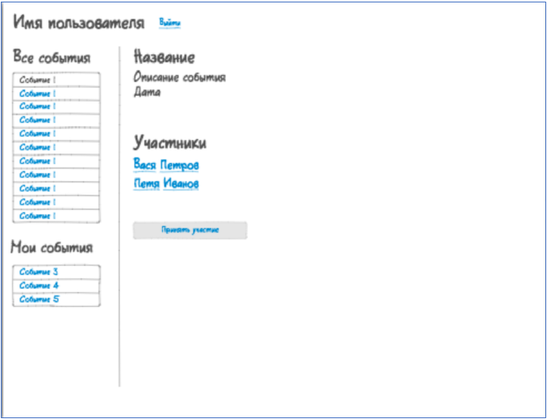

# Тестовое задание
Выполненное тестовое задание на вакансию backend-разработчик.
## Текст задания
Задание должно быть выполнено на PHP + Laravel.

1. Необходимо создать БД под управлением MySQL со следующими
сущностями:

а) Пользователь:

- id;
- Логин;
- Пароль;
- Имя;
- Фамилия;
- Дата регистрации;
- Дата рождения.

Все поля, кроме 'Дата рождения' не могут принимать нулевые значения

b) Event

- id;
- Заголовок;
- Текст;
- Дата создания;
- Создатель (сущность Пользователь);
- Участники (сущность Пользователи).

Все значения ненулевые.

2. Разработать RESTful API для:

а) регистрация пользователя;  
b) авторизация пользователя;  
c) создание события;  
d) получение списка событий;  
e) участие в событии;  
f) отмена участия в событии;  
g) удаление события создателем.  

Ответ с сервера должен приходить в виде такого JSON:  
`{"result":{"id":1, "first_name":"Вася", "last_name":"Петров"}}.`

3. Создать простую админку, используя AdminLTE:

- регистрация пользователя;
- авторизация пользователя;
- список событий;
- информация о пользователе.

Если в процессе регистрации или авторизации произошла ошибка,
необходимо показать диалоговое окно с описанием ошибки. При
успешной регистрации или авторизации открывается окно со списком
событий (см. скрин).

При просмотре НЕ своего события внизу находится кнопка "Принять
участие", при просмотре своего события - кнопка "Отказаться от участия"
Элементы "Все события" и "Участники" должны обновляться каждые 30
секунд, по возможности, без перезагрузки страницы.

При клике на участника показывается экран информации об участнике в
произвольном виде.

Макет внешнего вида:



## Установка

```
git clone https://github.com/Repet124/test-task.git
cd test-task
composer install
npm install
```
Перед запуском запустить миграции с флагом `--seed`

Пользователь по умолчанию:  
Логин: test_login  
Пароль: password

## Комментарии к заданию
- Разработка велась по методологии TDD
- Для кастомизации исключений и валидации были созданы соответсвующие классы:  
`App\Http\Requests\CustomFormRequest`  
`App\Exceptions\CustomValidateException`
- Для отладки и тестирования также был создан заполняющий класс:
`Database\Seeders\TestingSeeder`
- Задание было на вакансию backend-разработчик, тем не менее frontend также был проработан. Использовались следующие инструменты: **Vue**, **Vue-router**, **Pinia** *(использовал первый раз - отличная вещь)*, **AdminLTE**
